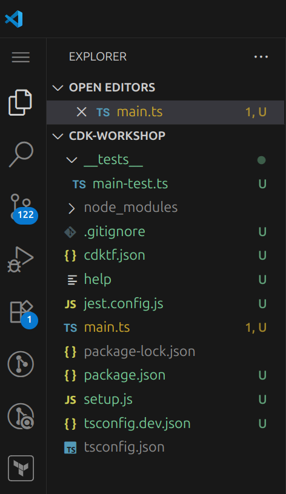

+++
title = "Project structure"
weight = 300
+++

## Open your IDE

Now's a good time to open the project in your favorite IDE and explore.

> If you use VSCode, you can just type `code .` within the project directory.

## Explore your project directory

You'll see something like this:



* __`main.ts`__ is where your CDKTF application's main stack is defined.
  This is the file we'll be spending most of our time in. this is also the entrypoint of the CDKTF application.
* `package.json` is your npm module manifest. It includes information like the
  name of your app, version, dependencies and build scripts like "watch" and
  "build" (`package-lock.json` is maintained by npm)
* `cdktf.json` tells the toolkit how to run your app. In our case it will be
  `"npx ts-node main.ts"`
* `tsconfig.json` your project's [typescript
  configuration](https://www.typescriptlang.org/docs/handbook/tsconfig-json.html)
* `.gitignore` tells git which files to include/exclude
  from source control.
* `node_modules` is maintained by npm and includes all your project's
  dependencies.

## Your app's entry point

Let's have a quick look at `main.ts`:

```ts
import { Construct } from "constructs";
import { App, TerraformStack } from "cdktf";

class MyStack extends TerraformStack {
  constructor(scope: Construct, id: string) {
    super(scope, id);

    // define resources here
  }
}

const app = new App();
new MyStack(app, "cdk-workshop");
app.synth();
```

This code defines, loads and instantiates the `MyStack` class. This is where the meat of our application is, the stack is empty for now.

