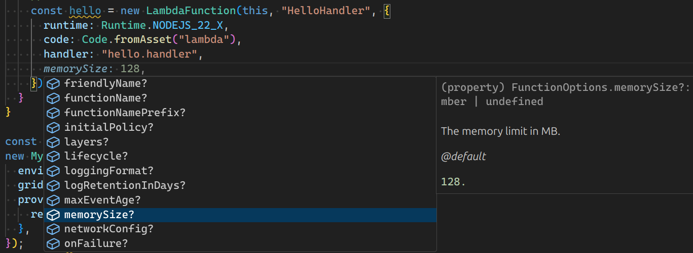
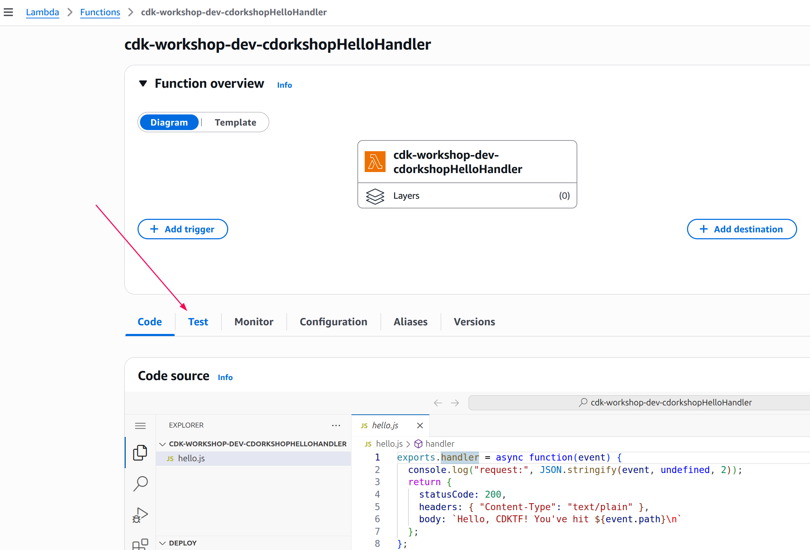
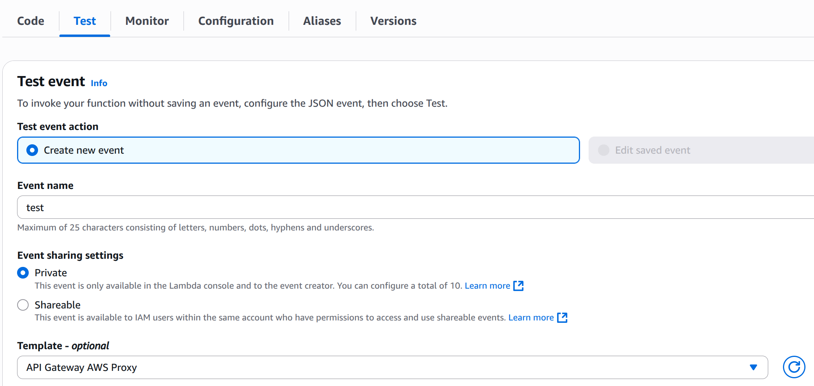

+++
title = "Hello Lambda"
weight = 200
+++

## Lambda handler code

We'll start with the Terraconstructs Lambda handler code.

1. Create a directory `lambda` in the root of your project tree (next to `bin`
   and `lib`).
2. TS CDKTF projects created with `cdktf init` ignore all `.js` files by default.
   To track these files with git, add `!lambda/*.js` to your `.gitignore` file.
   This ensures that your Lambda assets are properly checked into source control.
3. Add a file called `lambda/hello.js` with the following contents:

---
```js
exports.handler = async function(event) {
  console.log("request:", JSON.stringify(event, undefined, 2));
  return {
    statusCode: 200,
    headers: { "Content-Type": "text/plain" },
    body: `Hello, CDKTF! You've hit ${event.path}\n`
  };
};
```

This is a simple Lambda function which returns the text __"Hello, CDKTF! You've
hit [url path]"__. The function's output also includes the HTTP status code and
HTTP headers. These are used by API Gateway to formulate the HTTP response to
the user.

{} This lambda is provided in Javascript. For more information
on writing lambda functions in your language of choice, please refer to the AWS
Lambda documentation [here](https://docs.aws.amazon.com/lambda/latest/dg/welcome.html).
{}

## Install the AWS Lambda construct library

The TerraConstructs library is an extensive library of constructs. The construct library
is divided into __modules__, one for each Cloud and Service type it supports. For example,
if you want to define an AWS Lambda function, we will need to use the AWS Compute construct library.

<!--
TODO: publish API Reference ..
To discover and learn about AWS constructs, you can browse the [AWS Construct Library reference](https://docs.terraconstructs.dev/aws).


-->

## A few words about copying & pasting in this workshop

In this workshop, we highly recommended to type CDK code instead of copying &
pasting (there's usually not much to type). This way, you'll be able to fully
experience what it's like to use the CDK. It's especially cool to see your IDE
help you with auto-complete, inline documentation and type safety.



## Add an AWS Lambda Function to your stack

Add `import` statements at the beginning of `main.ts`, and a `LambdaFunction` to your stack.


import { App } from "cdktf";
import { Construct } from "constructs";
import { AwsStack, AwsStackProps } from "terraconstructs/lib/aws";
import { Code, LambdaFunction, Runtime } from "terraconstructs/lib/aws/compute";

class MyStack extends AwsStack {
  constructor(scope: Construct, id: string, props: AwsStackProps) {
    super(scope, id, props);

    // defines an AWS Lambda resource
    new LambdaFunction(this, "HelloHandler", {
      // functionNamePrefix: "your-prefix-hello-handler",
      runtime: Runtime.NODEJS_22_X,
      code: Code.fromAsset("lambda"),
      handler: "hello.handler",
    });
  }
}

const app = new App();
new MyStack(app, "cdk-workshop", {
  environmentName: "dev",
  gridUUID: "cdk-workshop-dev",
  providerConfig: {
    region: "us-east-1",
  },
});
app.synth();


A few things to notice:

- Our function uses the NodeJS (`NODEJS_22_X`) runtime
- The handler code is loaded from the `lambda` directory which we created
  earlier. Path is relative to where you execute `cdktf` from, which is the
  project's root directory
- The name of the handler function is `hello.handler` ("hello" is the name of
  the file and "handler" is the exported function name)

## A word about constructs and constructors

As you can see, the class constructors of both `MyStack` and
`LambdaFunction` (and many other classes in the CDK) have the signature
`(scope, id, props)`. This is because all of these classes are __constructs__.
Constructs are the basic building block of CDK apps. They represent abstract
"cloud components" which can be composed together into higher level abstractions
via scopes. Scopes can include constructs, which in turn can include other
constructs, etc.

Constructs are always created in the scope of another construct and must always
have an identifier which must be unique within the scope it's created.
Therefore, construct initializers (constructors) will always have the following
signature:

1. __`scope`__: the first argument is always the scope in which this construct
   is created. In almost all cases, you'll be defining constructs within the
   scope of _current_ construct, which means you'll usually just want to pass
   `this` for the first argument. Make a habit out of it.
2. __`id`__: the second argument is the __local identity__ of the construct.
   It's an ID that has to be unique amongst construct within the same scope. The
   CDKTF uses this identity to calculate the Terraform [Logical
   ID](https://developer.hashicorp.com/terraform/language/resources/syntax#resource-syntax)
   for each resource defined within this scope. *To read more about IDs in the
   CDK, see the* [CDKTF user manual](https://developer.hashicorp.com/terraform/cdktf/concepts/constructs#scope).
3. __`props`__: the last (sometimes optional) argument is always a set of
   initialization properties. Those are specific to each construct. For example,
   the `LambdaFunction` construct accepts properties like `runtime`, `code` and
   `handler`. You can explore the various options using your IDE's auto-complete
   <!-- or in the [online
   documentation](https://docs.aws.amazon.com/cdk/api/latest/docs/aws-lambda-readme.html). -->

## Diff

Save your code, and let's take a quick look at the diff before we deploy:

```
cdktf diff
```

Output would look like this:

```text
cdk-workshop  Terraform used the selected providers to generate the following execution plan.
              Resource actions are indicated with the following symbols:
                + create

              Terraform will perform the following actions:
cdk-workshop    # aws_cloudwatch_log_group.HelloHandler_LogGroup_49850324 (HelloHandler/LogGroup) will be created
                + resource "aws_cloudwatch_log_group" "HelloHandler_LogGroup_49850324" {
                    + arn               = (known after apply)
                    + id                = (known after apply)
                    + log_group_class   = (known after apply)
                    + name              = "/aws/lambda/cdk-workshop-dev-cdorkshopHelloHandler"
                    + name_prefix       = (known after apply)
                    + retention_in_days = 7
                    + skip_destroy      = false
                    + tags              = {
                        + "Name"                 = "dev-HelloHandler"
                        + "grid:EnvironmentName" = "dev"
                        + "grid:UUID"            = "cdk-workshop-dev"
                      }
                    + tags_all          = {
                        + "Name"                 = "dev-HelloHandler"
                        + "grid:EnvironmentName" = "dev"
                        + "grid:UUID"            = "cdk-workshop-dev"
                      }
                  }

                ...

                # aws_s3_object.FileAsset_S3 (FileAsset_S3) will be created
                + resource "aws_s3_object" "FileAsset_S3" {
                    + acl                    = (known after apply)
                    + arn                    = (known after apply)
                    + bucket                 = "cdk-workshop-dev-694710432912-us-east-1"
                    + bucket_key_enabled     = (known after apply)
                    + checksum_crc32         = (known after apply)
                    + checksum_crc32c        = (known after apply)
                    + checksum_crc64nvme     = (known after apply)
                    + checksum_sha1          = (known after apply)
                    + checksum_sha256        = (known after apply)
                    + content_type           = (known after apply)
                    + etag                   = (known after apply)
                    + force_destroy          = false
                    + id                     = (known after apply)
                    + key                    = "de63b575ee4558f96da9ebc022e06ff896758c0b7ddaab0ed4ab0e17318c9daa.zip"
                    + kms_key_id             = (known after apply)
                    + server_side_encryption = (known after apply)
                    + source                 = "assets/FileAsset/de63b575ee4558f96da9ebc022e06ff896758c0b7ddaab0ed4ab0e17318c9daa/archive.zip"
                    + source_hash            = "de63b575ee4558f96da9ebc022e06ff896758c0b7ddaab0ed4ab0e17318c9daa"
                    + storage_class          = (known after apply)
                    + tags_all               = (known after apply)
                    + version_id             = (known after apply)
                  }

              Plan: 6 to add, 0 to change, 0 to destroy.
```

As you can see, this code synthesizes an __aws_lambda_function__ resource. It
also synthesized a couple of AWS S3 Asset objects that are used by TerraConstructs
to propagate the location of the handler code.

## Deploy

Let's deploy:

```
cdktf deploy
```

You'll notice that `cdktf deploy` not only deployed your Terraform configuration, but
also archived and uploaded the `lambda` directory from your disk to the asset bucket.

## Testing our function

Let's go to the AWS Lambda Console and test our function.

1. Open the [AWS Lambda
   Console](https://console.aws.amazon.com/lambda/home#/functions) (make sure
   you are in the correct region).

    You should see our function:

    

2. Click on the function name to go to the console.

3. Click on the __Test__ tab tab under the __Function overview__:

    

4. Enter `test` under __Event name__.

    

5. Select __API Gateway AWS Proxy__ from the __Template__ list.

6. Hit __Test__ and wait for the execution to complete.

7. Expand __Details__ in the __Execution result__ pane and you should see our expected output:

    

# 👏

