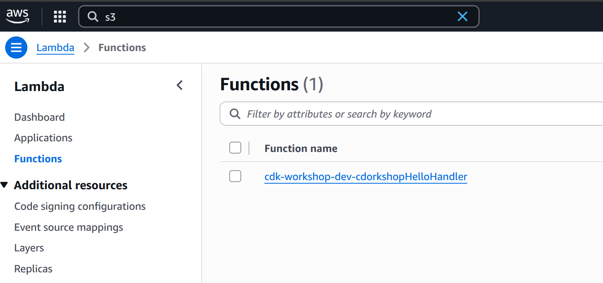

+++
title = "Optional - Watch"
weight = 300
+++

{} This section is not necessary to complete the workshop, but we
recommend that you take the time to see how `cdk watch` can speed up your personal deployments.
{}

<!--
## Faster personal deployments

{} This section is not necessary to complete the workshop, but we
recommend that you take the time to see how `cdk deploy --hotswap` and `cdk watch`
can speed up your personal deployments.
{}

It's great that we have a working lambda! But what if we want to tweak the lambda
code to get it just right? Let's say that we have now decided that we want our
lambda function to respond with `"Good Morning, CDKTF!"` instead of `"Hello, CDKTF"`.

So far, it seems like the only tool we have at our disposal to update our stack is
`cdktf deploy`. But `cdktf deploy` takes time; it has to deploy your CloudFormation
stack and upload the `lambda` directory from your disk to the bootstrap bucket. If
we're just changing our lambda code, we don't actually need to update the
CloudFormation stack, so that part of `cdktf deploy` is wasted effort.

We really only need to update our lambda code. It would be great if we had
some other mechanism for doing only that...

## Timing `cdktf deploy`

First, let's time how long it takes to run `cdktf deploy`. It will help us baseline how
long a full CloudFormation deployment takes. To do this, we are going to change the code
inside `lambda/hello.js`:


exports.handler = async function(event) {
  console.log("request:", JSON.stringify(event, undefined, 2));
  return {
    statusCode: 200,
    headers: { "Content-Type": "text/plain" },
    body: `Good Morning, CDK! You've hit ${event.path}\n`
  };
};


Then, we can run `cdk deploy`:

```
cdktf deploy
```

The output will look something like this:

```
✨  Synthesis time: 6s

CdktfWorkshopStack: deploying...
CdktfWorkshopStack: creating CloudFormation changeset...


 ✅  CdktfWorkshopStack

✨  Deployment time: 66.82s

Stack ARN:
arn:aws:cloudformation:REGION:ACCOUNT-ID:stack/CdkWorkshopStack/STACK-ID

✨  Total time: 72.82s
```

The exact time will vary but we should get a pretty good idea of how long a normal
deployment takes!

## Hotswap deployments

{} This command deliberately introduces drift in CloudFormation
stacks in order to speed up deployments. For this reason, only use it for
development purposes. Never use hotswap for your production deployments!
{}

We can speed up that deployment time with `cdktf deploy --hotswap`, which will
assess whether a hotswap deployment can be performed instead of a CloudFormation
deployment. If possible, the CDKTF CLI will use AWS service APIs to directly make
the changes; otherwise it will fall back to performing a full CloudFormation
deployment.

Here, we will use `cdktf deploy --hotswap` to deploy a hotswappable change to your
AWS Lambda asset code.

## Timing `cdktf deploy --hotswap`

Let's change the lambda code in `lambda/hello.js` another time:


exports.handler = async function(event) {
  console.log("request:", JSON.stringify(event, undefined, 2));
  return {
    statusCode: 200,
    headers: { "Content-Type": "text/plain" },
    body: `Good Afternoon, CDKTF! You've hit ${event.path}\n`
  };
};


Now, let's run `cdktf deploy --hotswap`:

```
cdktf deploy --hotswap
```

The output will look something like this:

```
✨  Synthesis time: 6.44s

⚠️ The --hotswap flag deliberately introduces CloudFormation drift to speed up deployments
⚠️ It should only be used for development - never use it for your production Stacks!

CdkWorkshopStack: deploying...
✨ hotswapping resources:
   ✨ Lambda Function 'CdkWorkshopStack-HelloHandler2E4FBA4D-tEZTcXqG8YYe'
✨ Lambda Function 'CdkWorkshopStack-HelloHandler2E4FBA4D-tEZTcXqG8YYe' hotswapped!

 ✅  CdktfWorkshopStack

✨  Deployment time: 3.07s

Stack ARN:
arn:aws:cloudformation:REGION:ACCOUNT-ID:stack/CdkWorkshopStack/STACK-ID

✨  Total time: 9.51s
```

Wow, deploying a hotswapped change took 3 seconds, while a full deployment took 67 seconds!
But take a look and read the warning message thoroughly - it's important!

```
⚠️ The --hotswap flag deliberately introduces CloudFormation drift to speed up deployments
⚠️ It should only be used for development - never use it for your production Stacks!
```

## Did the code actually change?

Wow that was fast. Did the code actually change? Let's go to the AWS Lambda Console and
double check!

1. Open the [AWS Lambda
   Console](https://console.aws.amazon.com/lambda/home#/functions) (make sure
   you are in the correct region).

    You should see our function:

    

2. Click on the function name to go to the console.

3. The code should be loaded onto the screen. Did your change show up?

    
-->

## CDKTF Watch

{} The watch command is experimental, so you should only use it in development environments. It also automatically deploys all changes without asking for confirmation.
{}

<!-- We can do better than calling `cdktf deploy` or `cdktf deploy --hotswap` each time. -->
We can do better than calling `cdktf deploy` each time.
`cdktf watch` is similar to `cdktf deploy` except that instead of being a one-shot
operation, it monitors your code and assets for changes and attempts to perform a
deployment automatically when a change is detected.
<!-- By default, `cdktf watch` will
use the `--hotswap` flag, which inspects the changes and determines if those
changes can be hotswapped. Calling `cdktf watch --no-hotswap` will disable the
hotswap behavior. -->

Once we set it up, we can use `cdktf watch --auto-approve` to detect changes that require
full Terraform apply.

## Modify your `cdktf.json` file

When the `cdktf watch` command runs, the files that it observes are determined by the
`"watchPattern"` setting in the `cdktf.json` file. the `watchPattern` expects an array
of glob patterns, e.g. `["main.ts", "../constructs/**/*.ts", "lib/*.ts"]`. See the [configure files to watch](https://developer.hashicorp.com/terraform/cdktf/create-and-deploy/configuration-file#configure-files-to-watch) section of configuration file overview.

Your `cdktf.json` file should look similar to this:

```json
{
  "language": "typescript",
  "app": "npx ts-node main.ts",
  // ...
  "watchPattern": [
    "./**/*.ts",
  ]
}
```

As you can see, the sample app comes with a suggested `"watchPattern"` setting. We do in
fact want to observe our `.js` files in the `lambda` folder, so let's add
`"lambda/*.js"` to the list:

```json
{
  "language": "typescript",
  "app": "npx ts-node main.ts",
  // ...
  "watchPattern": [
    "./**/*.ts",
    "lambda/*.js",
  ]
}
```

Now you're all set to start watching!

## Running `cdktf watch`

First, call `cdktf watch --auto-approve`:

```
cdk watch
```

This will trigger an initial deployment and immediately begin observing the files
we've specified in `cdktf.json`.

Let's change our lambda asset code in `lambda/hello.js` one more time:


exports.handler = async function(event) {
  console.log("request:", JSON.stringify(event, undefined, 2));
  return {
    statusCode: 200,
    headers: { "Content-Type": "text/plain" },
    body: `Good Night, CDKTF! You've hit ${event.path}\n`
  };
};


Once you save the changes to your Lambda code file, `cdktf watch` will recognize that
your file has changed and trigger a new deployment.

<!-- In this case, it will recognize
that we can hotswap the lambda asset code, so it will bypass a CloudFormation
deployment and deploy directly to the Lambda service instead.

How fast did deployment take?

```
Detected change to 'lambda/hello.js' (type: change). Triggering 'cdk deploy'

✨  Synthesis time: 5.57s

⚠️ The --hotswap flag deliberately introduces CloudFormation drift to speed up deployments
⚠️ It should only be used for development - never use it for your production Stacks!

CdkWorkshopStack: deploying...
✨ hotswapping resources:
   ✨ Lambda Function 'CdkWorkshopStack-HelloHandler2E4FBA4D-tEZTcXqG8YYe'
✨ Lambda Function 'CdkWorkshopStack-HelloHandler2E4FBA4D-tEZTcXqG8YYe' hotswapped!

 ✅  CdktfWorkshopStack

✨  Deployment time: 2.54s

Stack ARN:
arn:aws:cloudformation:REGION:ACCOUNT-ID:stack/CdkWorkshopStack/STACK-ID

✨  Total time: 8.11s
```
 -->

## Wrap Up

The rest of this tutorial will continue using `cdktf deploy` instead of `cdktf watch`.
But if you want to, you can simply keep `cdktf watch` on. If you need to make a full
deployment, `cdktf watch` will call `cdktf deploy` for you.

For a deeper dive on `cdktf watch` use cases, read
[Increasing Development Speed with CDKTF Watch](https://developer.hashicorp.com/terraform/cdktf/cli-reference/commands#watch).

