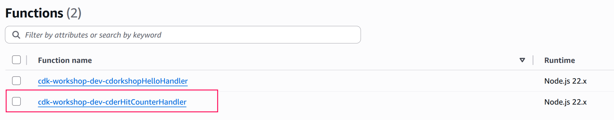
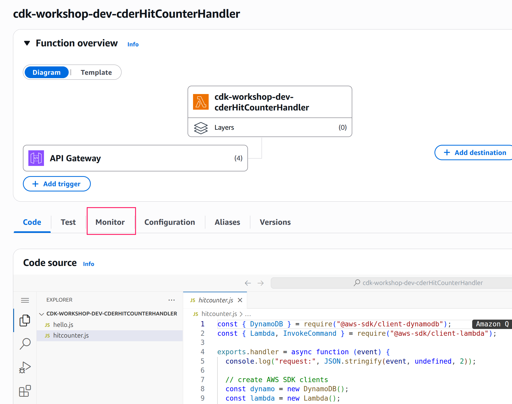
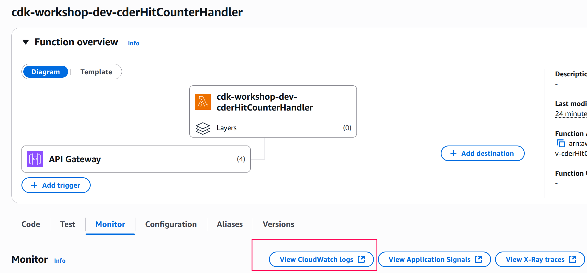
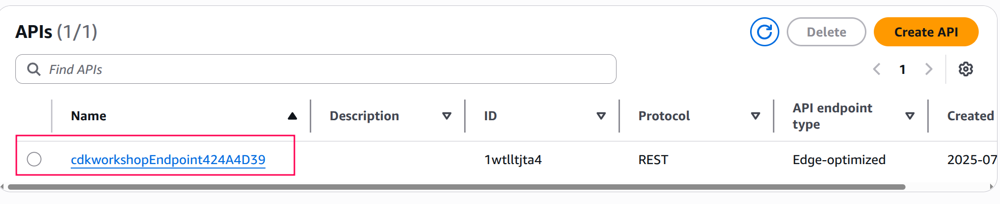
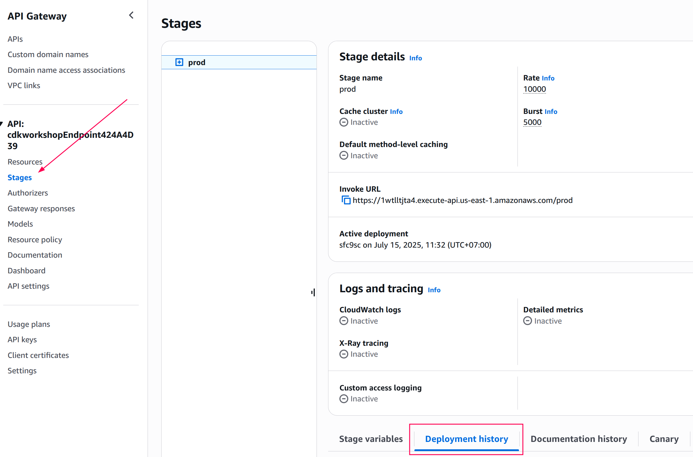

+++
title = "CloudWatch Logs"
weight = 500
+++

## Viewing CloudWatch logs for our Lambda function

The first thing to do is to go and look at the logs of our hit counter AWS
Lambda function.

There are many tools that help you do that like [SAM
CLI](https://github.com/awslabs/aws-sam-cli) and
[awslogs](https://github.com/jorgebastida/awslogs). In this workshop, we'll show
you how to find your logs through the AWS console.

1. Open the [AWS Lambda console](https://console.aws.amazon.com/lambda/home) (make sure you
   are connected to the correct region).

2. Click on the __HitCounter__ Lambda function
   (the name should contain the string `cdk-workshop-dev-...HitCounterHandler`):
    

3. Click on __Monitoring__
    

4. Click on __View Logs in CloudWatch__. This will open the AWS CloudWatch console.
    

5. Select the most-recent log group.

6. Look for the most-recent message containing the string "errorMessage". You'll likely see something like this:

   ```json
   {
        "errorType": "AccessDeniedException",
        "errorMessage": "User: arn:aws:sts::694710432912:assumed-role/cdk-workshop-dev-cdrHandlerServiceRole20250715042121401600000001/cdk-workshop-dev-cderHitCounterHandler is not authorized to perform: dynamodb:UpdateItem on resource: arn:aws:dynamodb:us-east-1:694710432912:table/cdkworkshopHelloHitCounterHitsF0859462 because no identity-based policy allows the dynamodb:UpdateItem action",
        "name": "AccessDeniedException",
        "stack": [
            "AccessDeniedException: User: arn:aws:sts::694710432912:assumed-role/cdk-workshop-dev-cdrHandlerServiceRole20250715042121401600000001/cdk-workshop-dev-cderHitCounterHandler is not authorized to perform: dynamodb:UpdateItem on resource: arn:aws:dynamodb:us-east-1:694710432912:table/cdkworkshopHelloHitCounterHitsF0859462 because no identity-based policy allows the dynamodb:UpdateItem action",
            "    at throwDefaultError (/var/runtime/node_modules/@aws-sdk/node_modules/@smithy/smithy-client/dist-cjs/index.js:867:20)",
            "    at /var/runtime/node_modules/@aws-sdk/node_modules/@smithy/smithy-client/dist-cjs/index.js:876:5",
            "    at de_CommandError (/var/runtime/node_modules/@aws-sdk/client-dynamodb/dist-cjs/index.js:2297:14)",
            "    at process.processTicksAndRejections (node:internal/process/task_queues:105:5)",
            "    at async /var/runtime/node_modules/@aws-sdk/node_modules/@smithy/middleware-serde/dist-cjs/index.js:35:20",
            "    at async /var/runtime/node_modules/@aws-sdk/node_modules/@smithy/core/dist-cjs/index.js:193:18",
            "    at async /var/runtime/node_modules/@aws-sdk/node_modules/@smithy/middleware-retry/dist-cjs/index.js:320:38",
            "    at async /var/runtime/node_modules/@aws-sdk/middleware-logger/dist-cjs/index.js:33:22",
            "    at async exports.handler (/var/task/hitcounter.js:12:3)"
        ]
    }
   ```

---

It seems like our Lambda function can't write to our DynamoDB table. This
actually makes sense - we didn't grant it those permissions! Let's go do that
now.

<!-- TODO: Is this bug in TerraConstructs deployment or just takes time to update? -->
{}
If you don't have any log groups, review the stage deployment history and/or force a redeployment, see below.
{}

## Forcing a redeployment

To force a redeployment through terraform we use `apply` with `-replace`
flag ([docs](https://developer.hashicorp.com/terraform/cli/commands/plan#replace-address)),
but first we need to know the logical address for the deployment.

1. Go to the stack directory
    ```
    cd cdktf.out/stacks/cdk-workshop
    ```

2. Grep the state for the deployment resource
    ```
    terraform state list | grep deployment
    ```

    You should see something like: `aws_api_gateway_deployment.Endpoint_Deployment_318525DA`

3. Force the deployment to be re-created
    ```
    terraform apply -replace aws_api_gateway_deployment.Endpoint_Deployment_318525DA
    ```

Now confirm the deployment history on the prod stage:

1. Open the [AWS Api Gateway console](https://console.aws.amazon.com/apigateway/main/apis) (make sure you
   are connected to the correct region).

2. Click on the cdkworkshopEndpoint API
    

3. Review the Stages deployment history
    

