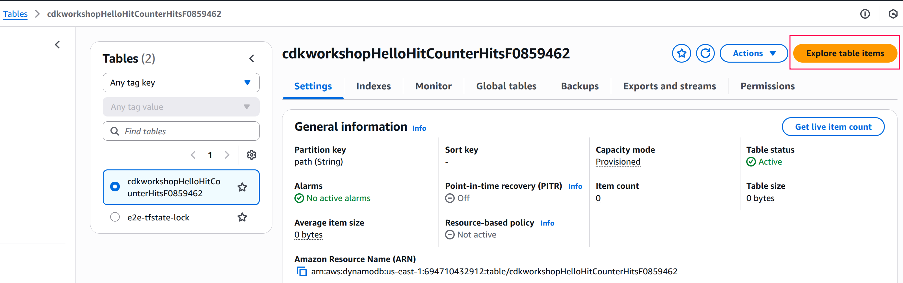
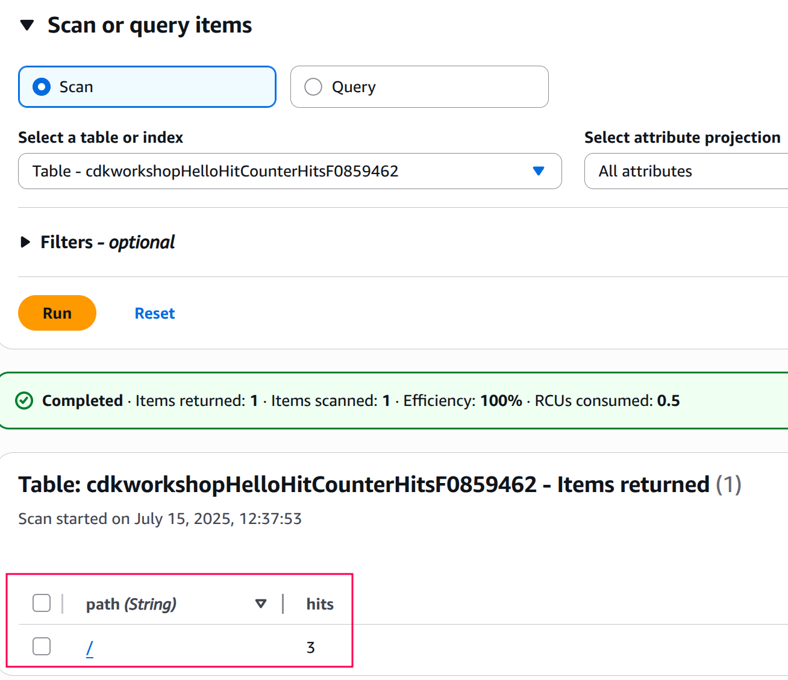

+++
title = "Granting permissions"
weight = 600
+++

## Allow Lambda to read/write our DynamoDB table

Let's give our Lambda's execution role permissions to read/write from our table.

Go back to `hitcounter.ts` and add the following highlighted lines:


import { Construct } from "constructs";
import {
  Code,
  LambdaFunction,
  IFunction,
  Runtime,
} from "terraconstructs/lib/aws/compute";
import { AttributeType, Table } from "terraconstructs/lib/aws/storage";

export interface HitCounterProps {
  /** the function for which we want to count url hits **/
  downstream: IFunction;
}

export class HitCounter extends Construct {
  /** allows accessing the counter function */
  public readonly handler: LambdaFunction;

  constructor(scope: Construct, id: string, props: HitCounterProps) {
    super(scope, id);

    const table = new Table(this, "Hits", {
      partitionKey: { name: "path", type: AttributeType.STRING },
    });

    this.handler = new LambdaFunction(this, "HitCounterHandler", {
      runtime: Runtime.NODEJS_22_X,
      handler: "hitcounter.handler",
      code: Code.fromAsset("lambda"),
      environment: {
        DOWNSTREAM_FUNCTION_NAME: props.downstream.functionName,
        HITS_TABLE_NAME: table.tableName,
      },
    });

    // grant the lambda role read/write permissions to our table
    table.grantReadWriteData(this.handler);
  }
}


## Deploy

Save & deploy:

```
cdktf deploy
```

## Test again

Okay, deployment is complete. Let's run our test again (either use `curl` or
your web browser):

```
curl -i https://xxxxxxxxxx.execute-api.us-east-1.amazonaws.com/prod/
```

Again?

```
HTTP/2 502 Bad Gateway
...

{"message": "Internal server error"}
```

# 😢

Still getting this pesky 5xx error! Let's look at our CloudWatch logs again
(click "Refresh"):

```json
{
    "errorType": "AccessDeniedException",
    "errorMessage": "User: arn:aws:sts::694710432912:assumed-role/cdk-workshop-dev-cdrHandlerServiceRole20250715042121401600000001/cdk-workshop-dev-cderHitCounterHandler is not authorized to perform: lambda:InvokeFunction on resource: arn:aws:lambda:us-east-1:694710432912:function:cdk-workshop-dev-cdorkshopHelloHandler because no identity-based policy allows the lambda:InvokeFunction action",
    "name": "AccessDeniedException",
    "message": "User: arn:aws:sts::694710432912:assumed-role/cdk-workshop-dev-cdrHandlerServiceRole20250715042121401600000001/cdk-workshop-dev-cderHitCounterHandler is not authorized to perform: lambda:InvokeFunction on resource: arn:aws:lambda:us-east-1:694710432912:function:cdk-workshop-dev-cdorkshopHelloHandler because no identity-based policy allows the lambda:InvokeFunction action",
    "stack": [
        "AccessDeniedException: User: arn:aws:sts::694710432912:assumed-role/cdk-workshop-dev-cdrHandlerServiceRole20250715042121401600000001/cdk-workshop-dev-cderHitCounterHandler is not authorized to perform: lambda:InvokeFunction on resource: arn:aws:lambda:us-east-1:694710432912:function:cdk-workshop-dev-cdorkshopHelloHandler because no identity-based policy allows the lambda:InvokeFunction action",
        "    at throwDefaultError (/var/runtime/node_modules/@aws-sdk/node_modules/@smithy/smithy-client/dist-cjs/index.js:867:20)",
        "    at /var/runtime/node_modules/@aws-sdk/node_modules/@smithy/smithy-client/dist-cjs/index.js:876:5",
        "    at de_CommandError (/var/runtime/node_modules/@aws-sdk/client-lambda/dist-cjs/index.js:4061:14)",
        "    at process.processTicksAndRejections (node:internal/process/task_queues:105:5)",
        "    at async /var/runtime/node_modules/@aws-sdk/node_modules/@smithy/middleware-serde/dist-cjs/index.js:35:20",
        "    at async /var/runtime/node_modules/@aws-sdk/node_modules/@smithy/core/dist-cjs/index.js:193:18",
        "    at async /var/runtime/node_modules/@aws-sdk/node_modules/@smithy/middleware-retry/dist-cjs/index.js:320:38",
        "    at async /var/runtime/node_modules/@aws-sdk/middleware-logger/dist-cjs/index.js:33:22",
        "    at async exports.handler (/var/task/hitcounter.js:25:23)"
    ]
}
```

Another access denied, but this time, if you take a close look:

```
User: <VERY-LONG-STRING> is not authorized to perform: lambda:InvokeFunction on resource: <VERY-LONG-STRING>"
```

So it seems like our hit counter actually managed to write to the database. We can confirm by
going to the [DynamoDB Console](https://console.aws.amazon.com/dynamodb/home) and exploring
the table items:



We should see the count for `/` path is incrementing now:



But, we must also give our hit counter permissions to invoke the downstream lambda function.

## Grant invoke permissions

Add the highlighted lines to `lib/hitcounter.ts`:



import { Construct } from "constructs";
import {
  Code,
  LambdaFunction,
  IFunction,
  Runtime,
} from "terraconstructs/lib/aws/compute";
import { AttributeType, Table } from "terraconstructs/lib/aws/storage";

export interface HitCounterProps {
  /** the function for which we want to count url hits **/
  downstream: IFunction;
}

export class HitCounter extends Construct {
  /** allows accessing the counter function */
  public readonly handler: LambdaFunction;

  constructor(scope: Construct, id: string, props: HitCounterProps) {
    super(scope, id);

    const table = new Table(this, "Hits", {
      partitionKey: { name: "path", type: AttributeType.STRING },
    });

    this.handler = new LambdaFunction(this, "HitCounterHandler", {
      runtime: Runtime.NODEJS_22_X,
      handler: "hitcounter.handler",
      code: Code.fromAsset("lambda"),
      environment: {
        DOWNSTREAM_FUNCTION_NAME: props.downstream.functionName,
        HITS_TABLE_NAME: table.tableName,
      },
    });

    // grant the lambda role read/write permissions to our table
    table.grantReadWriteData(this.handler);

    // grant the lambda role invoke permissions to the downstream function
    props.downstream.grantInvoke(this.handler);
  }
}


## Diff

You can check what this did using `cdktf diff`:

```
cdktf diff
```

The **aws_iam_role_policy** section should look something like this,
which shows the IAM statement was added to the role:

```
cdk-workshop    # aws_iam_role_policy.HelloHitCounter_HitCounterHandler_ServiceRole_DefaultPolicy_ResourceRoles0_B630511F (HelloHitCounter/HitCounterHandler/ServiceRole/DefaultPolicy/ResourceRoles0) will be updated in-place
                ~ resource "aws_iam_role_policy" "HelloHitCounter_HitCounterHandler_ServiceRole_DefaultPolicy_ResourceRoles0_B630511F" {
                      id          = "cdk-workshop-dev-cdrHandlerServiceRole20250715042121401600000001:cdkworkshopHelloHitCounterHitCounterHandlerServiceRoleDefaultPolicy688F79E1"
                      name        = "cdkworkshopHelloHitCounterHitCounterHandlerServiceRoleDefaultPolicy688F79E1"
                    ~ policy      = jsonencode(
                        ~ {
                            ~ Statement = [
                                  # (1 unchanged element hidden)
                                  {
                                      Action   = [
                                          "dynamodb:UpdateItem",
                                          "dynamodb:Scan",
                                          "dynamodb:Query",
                                          "dynamodb:PutItem",
                                          "dynamodb:GetShardIterator",
                                          "dynamodb:GetRecords",
                                          "dynamodb:GetItem",
                                          "dynamodb:DescribeTable",
                                          "dynamodb:DeleteItem",
                                          "dynamodb:ConditionCheckItem",
                                          "dynamodb:BatchWriteItem",
                                          "dynamodb:BatchGetItem",
                                      ]
                                      Effect   = "Allow"
                                      Resource = "arn:aws:dynamodb:us-east-1:694710432912:table/cdkworkshopHelloHitCounterHitsF0859462"
                                  },
                                + {
                                    + Action   = "lambda:InvokeFunction"
                                    + Effect   = "Allow"
                                    + Resource = [
                                        + "arn:aws:lambda:us-east-1:694710432912:function:cdk-workshop-dev-cdorkshopHelloHandler",
                                        + "arn:aws:apigateway:us-east-1:lambda:path/2015-03-31/functions/arn:aws:lambda:us-east-1:694710432912:function:cdk-workshop-dev-cdorkshopHelloHandler:$LATEST/invocations",
                                      ]
                                  },
                              ]
                              # (1 unchanged attribute hidden)
                          }
                      )
                      # (2 unchanged attributes hidden)
                  }

              Plan: 0 to add, 1 to change, 0 to destroy.
```
<!-- TODO: why does it include arn:aws:apigateway:us-east-1:lambda resource?? -->

Which is exactly what we wanted.

## Deploy

Okay... let's give this another shot:

```
cdktf deploy
```

Then hit your endpoint with `curl` or with your web browser:

```
curl -i https://xxxxxxxxxx.execute-api.us-east-1.amazonaws.com/prod/
```

Output should look like this:

```
HTTP/2 200 OK
...

Hello, CDK! You've hit /
```

> If you still get 5xx, give it a few seconds and try again. Sometimes API
Gateway takes a little bit to "flip" the endpoint to use the new deployment.

# 😲

